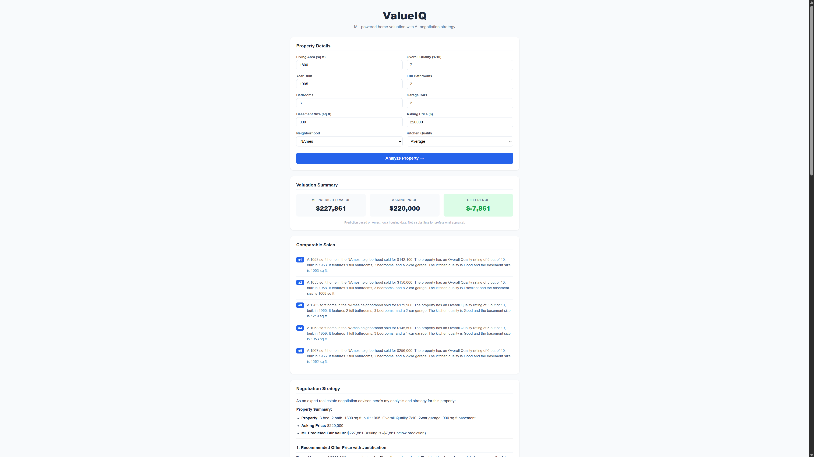

# ValueIQ

### ML-powered home valuation with AI-driven negotiation strategy

> Predicts home value from property and location data, then generates 
> negotiation strategy grounded in real comparable sales and market conditions.



---

## Why this exists

Buyers and sellers rarely have access to the data-driven pricing and 
negotiation insight that real estate agents use internally. ValueIQ estimates 
home value using machine learning, grounds that estimate in real neighborhood 
and market context via retrieval, and generates negotiation strategy from an 
LLM reasoning over that context — not just generic advice.

## Features

- Estimates home value from property attributes (square footage, bedrooms, 
  lot size, year built) and location (neighborhood, kitchen quality)
- Surfaces 5 comparable sales retrieved semantically from a vector store 
  of 2,927 embedded property records
- Generates negotiation strategy grounded in comps and ML prediction 
  rather than generic tips
- Color-coded valuation summary — green when asking price is below 
  predicted value, red when above

## Architecture

The system has four stages:

1. **Data layer** — Ames Housing dataset, cleaned and feature-engineered 
   across 6 notebooks
2. **Price prediction model** — Ridge regression (α=10) trained on 211 
   features after one-hot encoding
3. **RAG context retrieval** — FAISS vector store with 2,927 embedded 
   property documents using sentence-transformers (all-MiniLM-L6-v2), 
   returning top-5 comparable sales
4. **LLM negotiation engine** — Google Gemini generates strategy grounded 
   in the retrieved comps and model output

## Tech stack

- **Modeling:** Python, scikit-learn, XGBoost, pandas, numpy
- **RAG:** FAISS, sentence-transformers (all-MiniLM-L6-v2)
- **LLM:** Google Gemini API (gemini-2.5-flash)
- **Backend:** FastAPI, uvicorn
- **Frontend:** React 18, Vite, react-markdown
- **Data:** Ames Iowa Housing dataset via Kaggle

## Data sources & disclaimers

This project uses publicly available, aggregated datasets — it does **not** 
scrape or use live Zillow listings or Zestimate data.

- Housing data: [Ames Iowa Housing Data](https://www.kaggle.com/datasets/marcopale/housing) via Kaggle

Predictions are based on Ames, Iowa housing data and are not a substitute 
for professional appraisal.

## Setup

```bash
git clone https://github.com/Joaco273/ValueIQ.git
cd ValueIQ

# Backend
pip install -r requirements.txt
cd src
uvicorn api:app

# Frontend (separate terminal)
cd frontend
npm install
npm run dev
```

Create a `.env` file in the project root:

```
GEMINI_API_KEY=your-key-here
```

Run notebooks 01-06 in order to regenerate the model and vector store 
before starting the backend.

## Model performance

| Model | RMSE | MAE | R² | $ RMSE | $ MAE |
|---|---|---|---|---|---|
| Linear Regression (baseline) | 0.0985 | 0.0737 | 0.9460 | $18,414 | $12,999 |
| XGBoost (tuned) | 0.1092 | 0.0800 | 0.9337 | $24,429 | $15,011 |
| **Ridge (α=10) — final** | **0.0950** | **0.0716** | **0.9497** | **$18,157** | **$12,767** |

Ridge outperformed XGBoost on this dataset — strong linear relationships 
and clean feature engineering meant regularized linear regression captured 
most of the signal without the added complexity of tree-based methods.

## Roadmap

- [x] Phase 1 — Clean dataset, train and evaluate price model
- [x] Phase 2 — Build RAG layer for neighborhood/school context
- [x] Phase 3 — Add LLM negotiation reasoning grounded in comps
- [x] Phase 4 — Polish frontend, deploy live

## License

MIT — see [LICENSE](LICENSE) for details.